# 11_Clock_Dashboard

A desk clock for the Waveshare ESP32-S3-RLCD-4.2: it joins your WiFi, sets the time over NTP, works out the
time zone (including daylight saving) by itself, and shows everything on the reflective LCD. Version **1.3**.

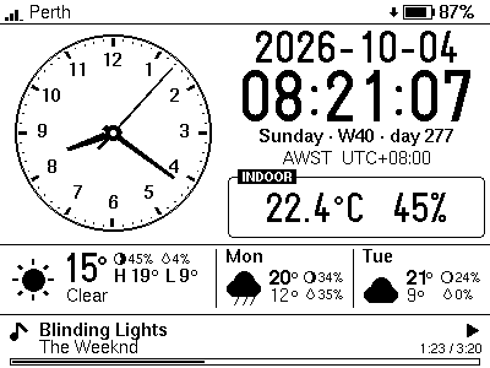

*The pictures in this README are renders of the real drawing code (see [Developer tools](#developer-tools)), not photos.*

| | |
| --- | --- |
| **Date and time** | Date (ISO `2026-10-04` unless you choose another of six formats), time with seconds (24 h, or a 12 h clock with AM / PM), weekday, ISO week number, day of year, zone name and UTC offset |
| **Analog clock** | Hour, minute and second hands; the second hand ticks exactly on the second (or sweeps, see `CLOCK_SWEEP_FPS`) |
| **Weather** | Now, today's high/low, and the next two days (Open-Meteo, no API key), each with the **chance of rain** (a drop) and the **moon** (how much of it is lit). Sunrise, sunset, UV and wind when nothing is playing |
| **Indoor** | Temperature and humidity from the on-board SHTC3, corrected for board self-heating |
| **Battery** | Gauge and percentage with a charging / discharging / full icon; **blinks below 20 %** (not while charging); an **estimate of the runtime left** on the Info page; a **gentle shutdown** before the cell is flat |
| **Spotify** | What is playing, progress, device and volume; the **KEY button** is the remote: 1 click play/pause, 2 clicks next, 3 clicks previous |
| **Settings** | Units, time and date format, WiFi (and WiFi *off*), location, time zone, Spotify, battery and power options from a **file on an SD card**, read once at boot and kept in the clock's flash, so the card can come out again |
| **Updates** | A new build can go in **from the SD card** (no cable, no WiFi needed): copy the exported `.ino.bin`, restart. It is checked first, installed into the second app slot, and kept only if it runs for a minute, else the old one returns |
| **Also** | WiFi strength, a legend page that explains every symbol and button, system and power info pages, hardware RTC so the right time shows before WiFi is up |

> **Status.** The first version of this sketch (clock, weather, indoor sensor, battery gauge, display) has run on the
> real board, and so have the 80 MHz setting and the frame timing described under [Power](#power) (measured by the
> board's owner). Everything added in 1.3, **the SD card settings, the shutdown and the runtime estimate, the clock
> drift measurement, the moon, the new screens**, as well as the Spotify linking flow, the charging indicator and the
> frame scheduler from earlier, has so far only been checked on a PC (renderer, fuzz test, simulations, tens of thousands
> of host-side checks) and compiled for the board. [Not yet tried on the board](#not-yet-tried-on-the-board) lists what
> that means, and [Troubleshooting](#troubleshooting) says what to look at if a first guess is off.

## Quick start

1. **Arduino IDE settings** (as the repo's [Tools-Configuration.png](../../../Tools-Configuration.png), with two changes
   that save power): ESP32S3 Dev Module, USB CDC On Boot *Enabled*, Flash Mode QIO 80 MHz, Flash Size 16 MB, Partition
   Scheme *16M Flash (3MB APP/9.9MB FATFS)*, **PSRAM *Disabled***, **CPU Frequency *80MHz (WiFi)***. Core: esp32 by
   Espressif **3.x** (built with 3.3.8). The clock needs neither the PSRAM nor the speed; together they cut the current
   to a third, see [Power](#power). (The sketch also sets 80 MHz itself, and the *Power and settings* page warns if the
   PSRAM is switched on.) The sketch is about 1.46 MB (46 % of the 3 MB app partition), so the default 1.2 MB partition
   scheme is too small.
2. **Libraries:** [U8g2](https://github.com/olikraus/u8g2) (a copy is in `01_Arduino_Libraries/U8g2`; copy it into your
   Arduino `libraries` folder or install it from the Library Manager) and **ArduinoJson 7.x** (Library Manager).
   WiFi, HTTPClient, WebServer, ESPmDNS, Preferences, Wire and the SD card driver come with the ESP32 core.
3. **WiFi and place:** either copy `secrets.example.h` to `secrets.h` and enter your WiFi name and password (2.4 GHz
   only; `secrets.h` is git-ignored; it can also hold `WIFI_SSID_BACKUP` / `WIFI_PASSWORD_BACKUP` for a second network,
   and `LOCATION_LATITUDE` / `LOCATION_LONGITUDE` or `LOCATION_QUERY`),
   **or** leave them out and put them in a settings file on an SD card after the first start, see
   [Settings from an SD card](#settings-from-an-sd-card). `secrets.h` is optional: without it the sketch compiles all the
   same and the clock starts with no network until the card says otherwise.
4. Upload. Open the Serial Monitor at 115200 baud for a log (type `help`). From then on a new build can also go in
   through the SD card, see [Updating the firmware from the SD card](#updating-the-firmware-from-the-sd-card).

Or from a terminal:

```bash
arduino-cli compile --fqbn esp32:esp32:esp32s3:CDCOnBoot=cdc,FlashSize=16M,PartitionScheme=app3M_fat9M_16MB,PSRAM=disabled,FlashMode=qio,CPUFreq=80 \
  --library ../../../01_Arduino_Libraries/U8g2 .
```

On the first start the status bar tells you what it is doing: *Connecting to WiFi*, *Syncing time*, *Updating weather*.
Until it knows where it is, the status bar says **Earth**. After that the clock keeps itself right: NTP re-syncs
hourly, weather refreshes every 15 minutes (`weather_interval_min`), and the time zone is saved so the correct local time
appears at power-up even before WiFi.

## Settings

Every setting has a built-in default (`config.h`, and `secrets.h` for the private ones). The clock also keeps settings in
its own flash, and reads a settings file from an SD card. Later wins:

> built-in default  <  saved in flash  <  the file on the SD card

### Settings from an SD card

1. **Format a card as FAT32** (the usual format of cards up to 32 GB; larger cards come as exFAT, which the clock cannot
   read, it says *SD card is not FAT32* on screen if you try). Any small card will do.
2. Put the card in the slot and **restart** the clock (turn it off and on again; the card is only looked at while it
   starts). When it finds a card without a settings file it **writes one**, `ESP32-S3-RLCD-Config.txt`, which explains every
   setting and has them all commented out, showing the value in use. A banner says *Wrote settings file to SD card*.
   (A copy of that file is in this repository: [`docs/ESP32-S3-RLCD-Config.example.txt`](docs/ESP32-S3-RLCD-Config.example.txt).)
3. Take the card to a computer, open the file in any text editor, remove the `#` in front of a setting, change its value,
   save.
4. Put the card back and restart. A banner says what happened (*SD settings: 4 changed*), the *Power and settings* page
   lists it and names any line it did not understand. **The settings are now kept in the clock's flash** and the card
   can be taken out. (It is only read at start-up, never while the clock runs, and a card that stays in costs a little
   power.)

The file is forgiving about how it is typed:

* One `name = value` per line. Spaces around the `=` do not matter, and `name: value` works too.
* Values can be in quotes or not: `"My Network"` and `My Network` are the same, with straight or curly quotes. Use quotes
  if a value contains a `#` or starts or ends with a space (`wifi_password = "p#ss "`); a bare `# comment` after a
  value is ignored.
* Names ignore capitals, spaces, `-` and `_` (`wifi_ssid`, `WiFi SSID` and `Wi-Fi-SSID` are one setting), and there are
  aliases such as `ssid`, `password`, `lat`, `lon`, `tz`.
* Numbers may use a comma for the decimal point and carry a unit (`3,4 V`, `80 MHz`, `31.95 S`, `115.86 E`).
* Lines that start with `#`, `;` or `//` are comments. Windows line ends, and files saved as UTF-8 with a BOM or as
  UTF-16, are fine.
* A setting that is not in the file keeps its value. **A line with nothing after the `=`** (`timezone =`) makes the clock
  forget that saved setting and go back to the built-in default; `reset_all = yes` forgets all of them first.
* Something it does not understand is skipped and reported, never fatal. A wrong value leaves the old one in place.

| Setting | What it does (default) |
| --- | --- |
| `wifi` | `on` / `off`. Off switches the radio off: no network time, weather or Spotify, and less power drawn (`on`) |
| `wifi_ssid`, `wifi_password` | The network (2.4 GHz). Passwords are plain text in the file and in the clock's flash. An open network: `wifi_password = ""` |
| `wifi_backup_ssid`, `wifi_backup_password` | A second network, used when the first cannot be joined (a phone's hotspot, another router); see [A backup network](#a-backup-network). Empty: no backup |
| `hostname` | The clock's name on the network, for the Spotify setup page `http://rlcd-clock.local` (`rlcd-clock`) |
| `ntp_server` | A time server to try first (empty: `pool.ntp.org`, `time.cloudflare.com`, `time.google.com`) |
| `wifi_power_save` | `normal` / `max`: how long the radio sleeps between messages. `max` saves a little more but can delay every reply, the network time included, by up to a third of a second (`normal`) |
| `units` | `metric` (°C, km/h) or `imperial` (°F, mph) (`metric`) |
| `time_format` | `24h` or `12h` with AM / PM (`24h`) |
| `date_format` | `iso` 2026-10-04, `dmy` 04/10/2026, `mdy` 10/04/2026, `dmy-dot` 04.10.2026, `d-mon-y` 4 Oct 2026, `mon-d-y` Oct 4, 2026 (`iso`) |
| `show_week` | The ISO week number and the day of the year after the weekday (`on`) |
| `latitude`, `longitude` | Exact coordinates; they win over `location` |
| `location_label` | What the status bar shows (empty: the name that was found) |
| `location` | A place to look up (Open-Meteo), such as `Perth` or `"Paris, France"` |
| `timezone` | An IANA name (`Australia/Perth`, not case sensitive) or a POSIX rule (`AWST-8`); empty: follow the location. **With WiFi off nothing can look it up: set it here** |
| `spotify`, `spotify_client_id` | Spotify on / off, and the Client ID of your own app (see [Spotify](#spotify)) |
| `indoor_offset` | °C added to the indoor temperature, to make up for the board's own heat (`-4.0`) |
| `battery` | `auto` or `none`. Say `none` when no battery is fitted: the gauge shows `USB` and nothing is estimated or shut down. The clock cannot tell by itself, see [Battery](#battery) (`auto`) |
| `battery_capacity_mah` | The battery's capacity, so the *Power and settings* page can show the average current (`0` = unknown) |
| `low_battery_shutdown`, `battery_cutoff_v` | Switch off before the cell is flat, and at what voltage, 3.10 to 3.60 (`on`, `3.30`) |
| `cpu_mhz` | `80`, `160` or `240`; 80 is plenty for a clock (`80`) |
| `weather_interval_min` | Minutes between weather updates, 5 to 240 (`15`) |

(`reset_all`, described above, is not a setting but an instruction.) The accepted spellings of every value are in
the example file the clock writes.

### A backup network

Give the clock a second network (`wifi_backup_ssid` and `wifi_backup_password`, or `WIFI_SSID_BACKUP` and
`WIFI_PASSWORD_BACKUP` in `secrets.h`) and it uses that when the first cannot be joined: a phone's hotspot, another
router, the guest network.

* The main network always comes first, at start-up and after a drop. If it is not joined within 20 seconds the clock
  tries the backup, and so on, one after the other, until one of them works.
* While it sits on the backup the clock **looks for the main network every 10 minutes** (a scan of a few seconds, not
  while the Spotify setup page is being served) and goes back to it as soon as it is in range (-80 dBm or better), so it
  does not stay on a phone's hotspot for days. If going back does not work (the main network is in range but will not
  take the clock) the looks come further apart, 20 minutes, 40, then every hour, until the main network is joined again.
  A *hidden* main network cannot be seen by a scan: the clock then stays on the backup until that drops.
* The *Info* page says `(backup)` after the network name when the clock is on the second network.
* "Joined" means the clock has an address on that network. A network that is up but has no internet is not noticed: the
  clock would carry on trying the weather and the time there.
* A backup that has the same name as the main network is ignored. With only a backup set, it is simply the network.

## Updating the firmware from the SD card

A clock on a shelf, perhaps with WiFi off, can be updated without a cable: build the sketch on your computer, copy the
firmware file to the SD card, put the card in and restart the clock.

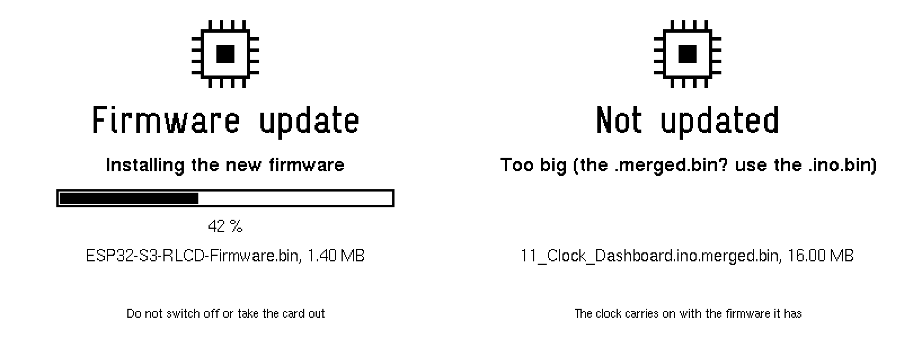

1. In the Arduino IDE choose **Sketch → Export Compiled Binary** (or add `--export-binaries` to `arduino-cli compile`),
   with the same board settings as for a USB upload. The sketch's `build/<board>/` folder then holds several files; the one
   you want is **`11_Clock_Dashboard.ino.bin`**. Not the `….merged.bin`: that is the whole 16 MB flash image for a first
   install with a programmer, and the clock refuses it (*Too big*).
2. Copy it to the top folder of the FAT32 card, as it is or named **`ESP32-S3-RLCD-Firmware.bin`**. With more than one of
   these files on the card the clock does nothing and says so.
3. Put the card in and restart the clock. At start-up it checks the file, shows a progress screen, writes the firmware and
   restarts into it; about 15 to 30 seconds (an estimate, not measured). Afterwards the file is renamed `….done`, so it is
   not installed again. A settings file on the same card is applied first.

How it stays safe:

* **The firmware that runs is not touched** until the new one has been written and checked. The whole file is first
  compared with the SHA-256 at its end (a damaged or cut-short copy is refused before anything is written), then it goes
  into the *other* of the two app slots, and the bootloader is switched over only after that image has verified. A card
  taken out half-way, or a power cut, only loses the update.
* **Files it will not use** (the screen says why): the wrong chip (it has to be an ESP32-S3 app image), a bootloader or
  `.merged.bin`, a file too big for the slot, the build that is already running, a build the card installed before (so a card
  left in the clock cannot make it install the same file again and again; `fwforget` on the serial console allows it), and
  anything while the battery is under 3.60 V (plug in USB first).
* **A new firmware is on trial for its first minute.** If the clock resets in that minute (a crash, a hang the watchdog
  catches, or you pulling the plug) the bootloader puts the previous firmware back, and the Info page says so (*the last
  SD card update was rolled back*). After a minute without a reset the new one is kept. The Info page counts the trial
  down; going to sleep on purpose and the `reboot` serial command count as passing it.
* **Needs two app slots.** The partition scheme from the Quick start has them; a single-app scheme gets the message *No
  second app slot*. The very first install of this feature has to come by USB, as the updater has to be in the firmware.
  A USB upload always works, whatever happened to the slots.
* There is **no signing**: whoever can put a file on the card can change the firmware, as whoever has a USB cable can.

Serial console: `fw` shows what runs and what is in the other slot, `rollback` switches to the other slot now (and restarts),
`fwforget` clears the memory of the last build installed from the card.

If you leave **WiFi off**, nothing corrects the clock any more: it starts from the hardware RTC and then counts with its
own crystal. A clock crystal is good for a second or two a day, depending on the temperature; the clock **measures its own
error** while it has WiFi (see [Time zone and clock](#time-zone-and-clock)) and puts the figure into the example file.
Turn WiFi on for a few minutes now and then and it sets itself again.

## Controls

| Button | Gesture | Action |
| --- | --- | --- |
| **KEY** (GPIO18) | 1 click | Play / pause |
| | 2 clicks | Next track |
| | 3 clicks | Previous track (like most players, Spotify may restart the current track first if it is well in) |
| | hold 0.8 s | Refresh weather and Spotify now |
| **BOOT** (GPIO0) | click | Next page: Dashboard, Now Playing, System info, Power and settings, Legend |
| | 2 clicks | Back to the dashboard |
| | 3 clicks | System info page |
| | hold 1 s | Invert the screen (remembered) |

Each key action shows a banner at the bottom of the screen straight away; if Spotify refuses (no active device, rate
limited, no Premium) the banner changes to say why. The **Legend** page shows these and every symbol on the screens, drawn
with the same code as the screens themselves:

<p>
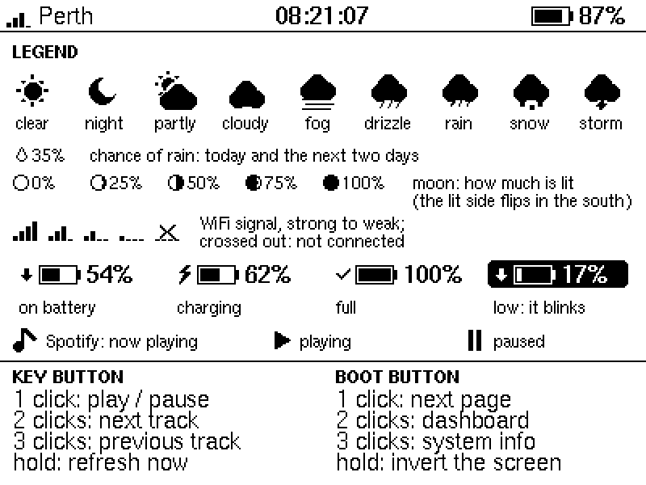
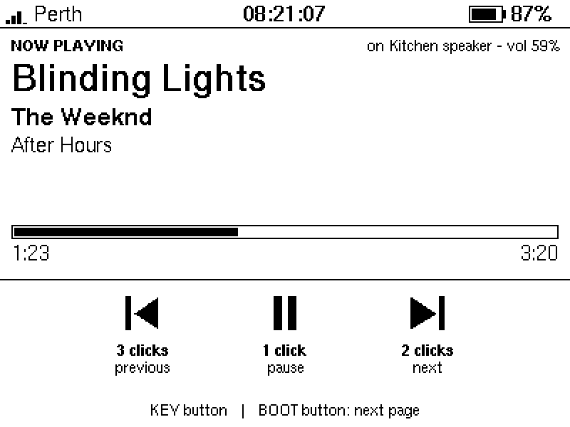
</p>
<p>
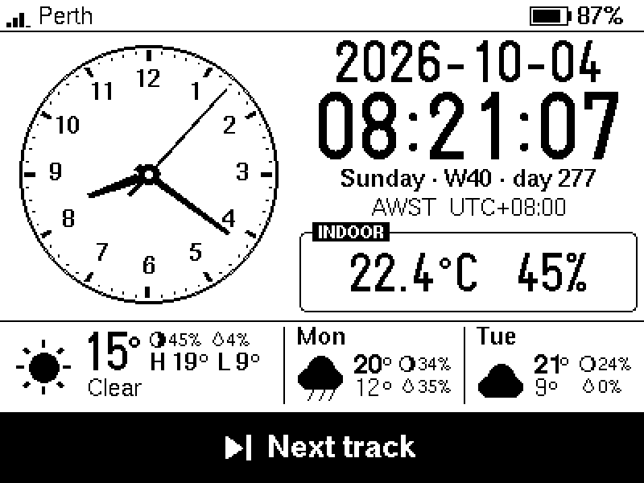
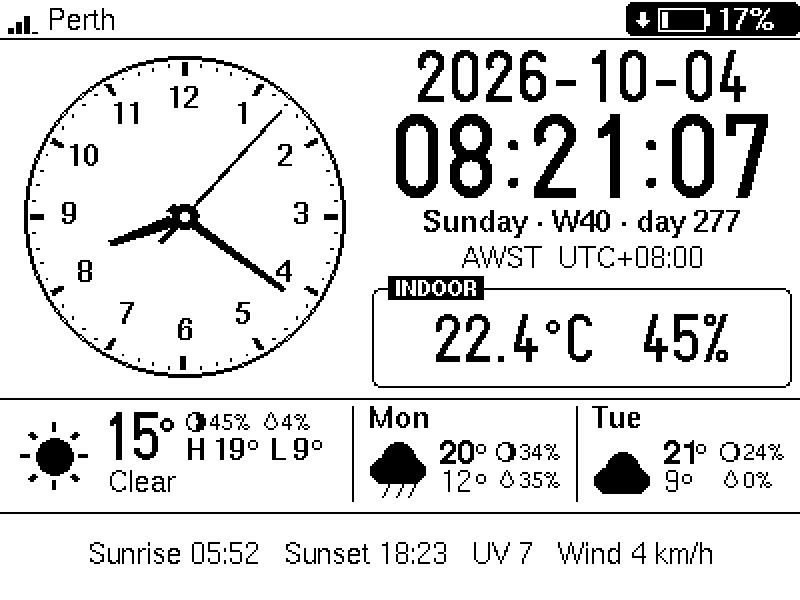
</p>

*The legend page, the Now Playing page, the feedback banner for a key press, and one phase of the low-battery blink (the
gauge alternates between normal and inverted once per second below `BATTERY_LOW_PERCENT`).*

## Weather, rain and the moon

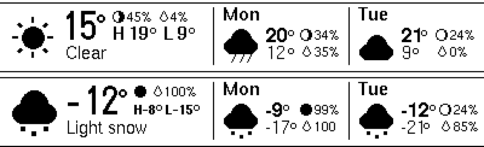

*Today (left) and the next two days. Top row of today: the moon and the chance of rain; below: the high and the low on one
line. The big temperature starts exactly where the condition text ("Clear") does.*

* A drop and a percentage is the **chance of rain** (the day's maximum, from Open-Meteo). The drop is outlined like the
  moon, 7 × 9 pixels, and its bottom row is the bottom row of the digits beside it.
* The **moon** is drawn as a 10 pixel disc, the lit part filled, with the share lit next to it. A growing moon is lit on
  the right when seen from the northern hemisphere and on the left from the southern; the clock mirrors it by the sign of
  your latitude (when it knows it). The three discs are the moon at this time of day today, tomorrow and the day after.
* There is no moon data in the weather service, so it is computed on the clock from the date (`moon.h`: the main terms of
  the standard series for the Sun's and the Moon's longitude). Checked against 24 published new and full moons (the
  eclipses of 2000 to 2025 and every new moon of 2024) and four quarters, the darkest and the brightest moments land
  within half an hour of the almanac, and the share lit is good to a fraction of a percent.
* Wide numbers squeeze the row beside them (-12 °, 104 °F): the moon first loses its percentage, then the moon goes, and
  the high and low shrink their gaps and then their type; nothing ever touches the separators (checked on the rendered
  pixels).

## Spotify

Optional. Without a Client ID the clock simply has no Spotify features. Spotify has no way to ask your phone or PC what
is playing except through its Web API, so the clock needs your permission once.

**You need:** a Spotify **Premium** account. Spotify requires Premium both to *own* a development-mode app and to
*control* playback through the API. A free account cannot be used for either. (Rules checked against Spotify's
documentation in October 2026; they have been changing, see the links at the end.)

**Set up**

1. Open the [Spotify developer dashboard](https://developer.spotify.com/dashboard), *Create app*. Any name; tick *Web API*.
   Under **Redirect URIs** add exactly `http://127.0.0.1:8888/callback` and save (Spotify does not accept `localhost`).
2. In the app's *Settings > User Management* make sure your own Spotify account is listed (development-mode apps work
   for up to 5 allow-listed users).
3. Copy the app's **Client ID** into `secrets.h` as `SPOTIFY_CLIENT_ID`, or into the SD card settings as
   `spotify_client_id`. No client secret is used or stored.
4. Restart. The bottom strip of the dashboard now says *Spotify: open http://192.168.x.x to link*. Open that address (or
   `http://rlcd-clock.local`) in a browser on the same network. The page offers two ways to finish:
   * **A. The helper (easiest; needs Python 3 on the computer you are browsing from).** Download `spotify_link.py`
     from the page (the clock serves it) and run `python spotify_link.py 192.168.x.x`. It opens Spotify; press *Agree*
     and the clock is linked. Nothing is installed and the script exits when it is done.
   * **B. By hand, any browser.** Follow the page's *Open Spotify* link and approve. The browser then lands on a
     "can't reach this page" error for `127.0.0.1`; that is expected. Copy the **whole address** from the address bar
     (`http://127.0.0.1:8888/callback?code=...`) and paste it into the box on the clock's page.
5. Play something on any device. It appears on the clock within about 10 seconds. If a device has been idle for a while
   Spotify forgets it; press KEY once and the clock asks Spotify to resume on the last device it saw.

**Why 127.0.0.1 and a helper?** Spotify refuses a plain-http redirect as *insecure*, with one exception: `127.0.0.1`,
which means "this computer". So Spotify's answer is always sent to the computer you approve on, and something there has
to pass it to the clock: the helper does (it listens on `127.0.0.1:8888` while you approve, up to five minutes, and
forwards the redirect to the clock's `/callback`), or you do, by pasting the address. An `https://` redirect straight to
the clock is possible in principle, but the clock would have to serve TLS with a self-signed certificate (so the browser
warns every time) and its address would have to be registered in the Spotify dashboard (so it needs a fixed IP); that was
not done. A small hosted redirect page would be another way, at the price of depending on a web host.

**Good to know**

* The link page is only served while no account is linked (and during the last 14 days before the link expires). The
  little web server handles one connection at a time, so if the page takes a few seconds to appear the first time
  (browsers sometimes open a spare connection), just wait or reload. While it is being served the radio's longer sleep
  (`wifi_power_save = max`) is switched off so the page answers promptly.
* Only the *read playback state* and *modify playback state* permissions are requested.
* The refresh token is kept in the chip's flash (NVS), unencrypted, like any other WiFi-connected hobby device.
  `unlink` in the serial console forgets it.
* **Spotify expires the link after 6 months** whatever you do. The Info page shows the days left; when 14 remain the
  link page comes back so you can renew in a minute. If it lapses the clock goes back to *please link again*.
* Spotify gives development-mode apps a small request quota and has locked out polling that was too eager. The clock
  polls every 10 s while playing (15 s paused, 30 s idle), extrapolates the progress bar in between, and obeys a `429`
  `Retry-After` even across reboots (the dashboard says how long). A KEY press first looks at what the player is
  really doing, so pressing it right after starting music on your phone pauses it instead of sending a useless "play".
* Titles in scripts the built-in fonts do not cover (CJK, Cyrillic, ...) show `?` for those letters; typographic quotes
  and dashes are mapped to ASCII.

## Time zone and clock

* `location` -> Open-Meteo returns the IANA zone (`Australia/Perth`) -> `tz_table.cpp` (597 zones from the tz database)
  maps it to a POSIX rule (`AWST-8`) -> `tzset()`. Daylight saving then happens on the device with no more lookups,
  and the rule is saved to flash. A zone name newer than the table falls back to a fixed UTC offset that is refreshed
  with every weather update. The `timezone` setting pins a zone by hand (an IANA name, or a POSIX rule).
* The PCF85063 RTC holds UTC. At boot it provides the time immediately; each NTP sync (hourly) updates it. HTTPS needs a
  believable clock, so network requests wait for NTP or a valid RTC. With WiFi off the RTC is the only source, and a
  board whose RTC was never set stays at `--:--:--` until WiFi has been on once.
* Digits that change every second, minute or day are laid out in fixed cells (`ui.cpp`), so the time does not shift
  sideways as it counts: U8g2 measures a string by its ink, and centring on that moved the clock by up to 5 px
  depending on which digits it held. The host renderer checks this on thousands of frames (the 24 h clock, the 12 h
  clock with its colon, the date, the status-bar clock), each with a deliberate failure to make sure the check can see it.
* **How far off is the clock's crystal?** Each NTP sync corrects the system clock by the amount it had drifted since the
  last. `drift.h` keeps the corrections, fits a line through them (one point per half hour, up to two days) and shows the
  result on the *Power and settings* page as parts per million and seconds a day, once it has three hours of syncs. It is
  also kept in flash for the note in the example settings file. In simulation, with 30 ms of network jitter, a day of
  hourly syncs measures a drift to within one ppm (a ppm is 0.09 s a day).

### Date and time formats

`time_format = 12h` shows `9:45` large with the seconds and AM / PM small beside it; a one-digit hour leaves its cell
empty rather than moving everything. Dates in the text formats (`4 Oct 2026`, `Oct 4, 2026`) use English month names.
All six formats fit the date line in every month (checked on the rendered pixels).

<p>
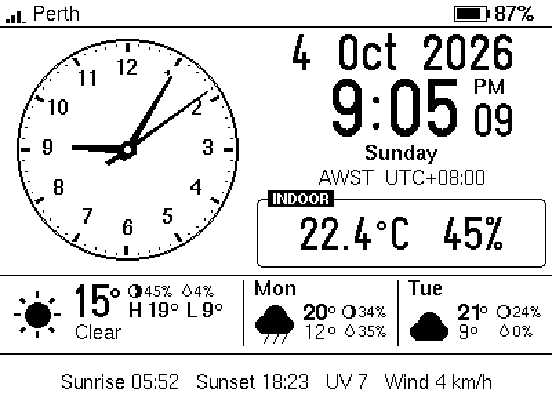
</p>

### Keeping the seconds on time

The panel refreshes itself at about 25 Hz, so a frame shows up 0 to 39 ms after it has been sent. The clock therefore
draws the coming second into the display buffer ahead of time (with at least 60 ms to spare, more if drawing has been
slow lately) and sends it just before the second starts, timed so the average error is zero (`DISPLAY_LATENCY_MS`).
A slow draw cannot make the digits late any more, only the short transfer is exposed. `frame_plan.h` holds the
schedule; in a simulation of the UI loop (not on the board) with one draw in ten taking four times as long, 148 of 1568
frames went out more than 50 ms late with the earlier draw-just-in-time loop and none with this one, and with random
20-300 ms stalls (a flash write, WiFi activity) the count fell from 234 to 50 of 3525. A stall of more than about
150 ms still shows: nothing in software can hide a frozen CPU. **On the board, at 80 MHz, after a while: 1154 frames sent,
0 late, worst 2 ms** (the *Frames* line of the Info page).

Two things are also kept away from the moment of the tick: slow work (the sensor reads) only runs when more than 300 ms
are left, and flash writes (saving a time zone or a Spotify token; the flash is only touched when the value changed)
wait for the middle of a second, because a flash write stops both cores for a while. The WiFi status calls are made
before the shared-state lock is taken, so a slow WiFi driver cannot hold the UI up.

**If the seconds still stutter now and then,** the Info page says where to look:

| Info page line | Meaning |
| --- | --- |
| `Frames   11520 sent, 2 late, worst 61 ms` | Frames that went out more than 30 ms behind plan, and the worst. Anything here means the firmware itself stalled (the serial log prints every frame more than 100 ms late; `timing` shows the draw and send times) |
| `Time     NTP synced 12 min ago, last step -38 ms` | The size of the last correction NTP made to the clock. Steps of 100 ms or more mean the network's latency is uneven (satellite and mobile links can do that) and the displayed seconds were that far off for a while |

Both quiet while you still see a stutter: the delay is in the panel itself.

## Indoor temperature

The SHTC3 sits beside the ESP32 and the battery charger, so it reads warm. `indoor_offset` defaults to **-4.0 °C**,
the value Waveshare's own driver subtracts; calibrate it against a thermometer you trust and put the sensor reading from
the Info page next to it. Humidity is corrected to match (relative humidity rises as air cools), which Waveshare's
driver does not do.

## Battery

Reads the divider on GPIO4 (x3), averages 16 ADC samples, smooths the result, and maps the voltage to a charge level
with a lithium discharge curve rather than a straight line. The gauge blinks below `BATTERY_LOW_PERCENT` (20) and stops
once it has recovered to 23 so it cannot flicker around the threshold; it does not blink while the battery is being
charged.

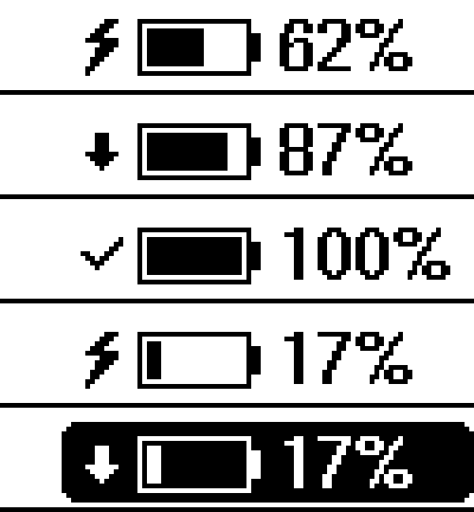

*The icon beside the gauge, top to bottom: charging (⚡), running on the battery (▼), full (✓), 17 % while charging (no
blink), 17 % on the battery (blink phase).*

**No battery fitted?** The clock cannot tell. On USB the empty battery connector reads about 4.2 V, like a full cell, so
a clock running from USB alone shows a full battery. Say `battery = none` in the settings and the gauge shows `USB`
instead, with no charge icon, no estimate and no shutdown.

**How it knows what the battery is doing.** The board has no charge-status signal (the charger's STAT output only lights
an LED), so `charge.h` works it out from how the battery voltage moves:

* plugging USB in makes the charger push current through the cell, so the voltage steps up by tens of millivolts at
  once; unplugging steps it down. A step of 40 mV or more that stays is spotted about a minute after the cable moves;
* while charging the voltage climbs 1.5 mV per minute or more; on the battery it falls (steeply near full, slowly in the
  flat middle of the curve); a charger that has finished holds it flat near 4.2 V, which is shown as full;
* that trend is judged over the last 12 minutes (8 before it is trusted). Readings are reduced to the upper end of each
  15 s so WiFi transmit dips do not count, and a change in load, which moves the voltage for good and fools a plain
  straight-line fit, has to be confirmed by a second fit that allows one level shift;
* the first three minutes after boot are not used at all: the board draws more while it joins WiFi and fetches over
  TLS, the battery sags under it and recovers, and in the simulations that recovery was taken for a plug-in on almost
  every boot once the sag reached 60 mV.

It is a heuristic and shows no icon rather than guess. Timings against simulated traces (noise, WiFi dips, level
shifts; 300 random sequences each), not against the board:

| What happens | Icon changes after |
| --- | --- |
| USB plugged in or pulled out with a step of 45 mV or more | about 1 minute (not in the first ~5 minutes after boot) |
| ... with a small step | 5 to 10 minutes |
| After a reboot | about 13 minutes, sometimes up to 20 (the Info page says *starting up*, then *learning*) |
| A full battery unplugged (no step, the voltage just starts to fall) | 7 to 30 minutes, slower for lighter loads |

What it cannot do: charging slower than about 0.1C (under roughly 1.5 mV/min) is not recognised; a charger that lets the
cell sag after it has finished looks like discharging, which for the cell it is; and a sudden jump in load of 15 mV or
more is mistaken for a few minutes of charging about once in 60 jumps.

The serial console command `battery` prints the voltage, the trend in mV/min, the last step and how much data the
detector has, and the same line is logged once a minute; if the icon ever disagrees with reality those are the numbers
to look at. The thresholds are named constants at the top of `charge.h`.

**For a certain answer** solder a wire from the charger's STAT output (the net that lights the charge LED; check with a
meter that it goes low while charging) to a free GPIO and set `PIN_CHARGE_STATUS` in `config.h`. Low then means
charging; the voltage still decides between full and discharging. This is untested on real hardware.

### How long will it last?

The *System info* page has a **Left** line, and the *Power and settings* page the detail:

<p>
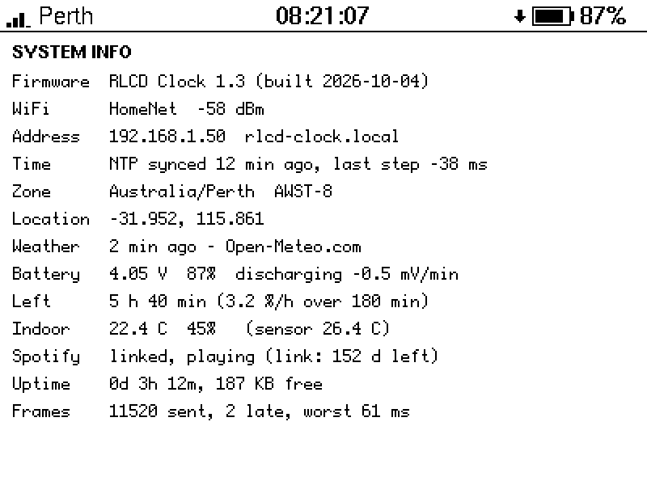
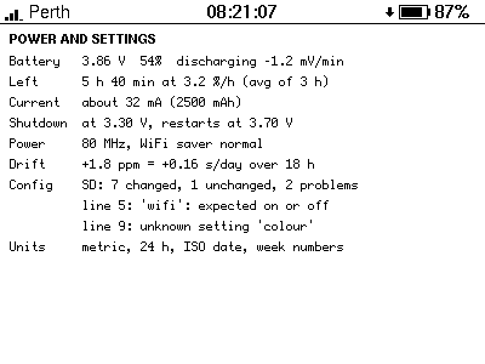
</p>

```
Battery   3.86 V  54%  discharging -1.2 mV/min
Left      5 h 40 min (3.2 %/h over 180 min)
Current   about 32 mA (of 2500 mAh)            <- when battery_capacity_mah is set
```

* The voltage is turned into a percentage through the discharge curve *first*. The same drain in mA is a very different
  number of millivolts per minute depending on where on the curve the cell is (about 2 mV per percent in the middle, 15
  and more near empty), so a trend in volts means little (the same load can read *-4.4 mV/min* near the top of the curve
  and *-2.1 mV/min* lower down); a trend in percent is one steady rate all the way down.
* Readings are boiled down to one point per five minutes (their median, so the dips of WiFi transmissions vanish), the
  first 15 minutes after the clock went onto the battery are ignored (a cell just off the charger is still settling),
  and the first figure appears after 30 minutes of settled readings (the page says *learning: first figure in N min*).
* The rate is a straight line through the points of the last **2 to 8 hours: long enough for the cell to lose about 20 %
  in it**, so a fast drain (a small cell, Spotify playing) is judged over about two hours and a slow one over most of a
  day. Longer is better because the middle of the curve is nearly flat: a few millivolts there are several percent, so a
  30 minute window chased noise (it was off by 60 % or more one time in ten in simulation). The page says how many
  minutes the figure rests on.
* "Hours left" is the percent above the shutdown voltage divided by that rate: it promises the time at the *average*
  load of the window, the best guess when the load varies. It cannot know what you will do next (turn WiFi off and the
  real answer changes at once; the estimate follows over the next hours).
* **How good is it?** `tools/tests/battery_sim.cpp` simulates whole discharges (a cell model with internal resistance,
  ADC noise and WiFi dips; loads of 8 to 90 mA; capacities of 100 to 2500 mAh) and scores the estimate against the true
  time left: in steady drains the typical (median) error was **4 to 16 %** and nine in ten estimates were within **7 to
  41 %**; with a load that changes every couple of hours it was worse, as it must be. That is a model of a cell, not
  your cell: treat the figure as a rough guide, most of all in the first hour or two.

### The shutdown

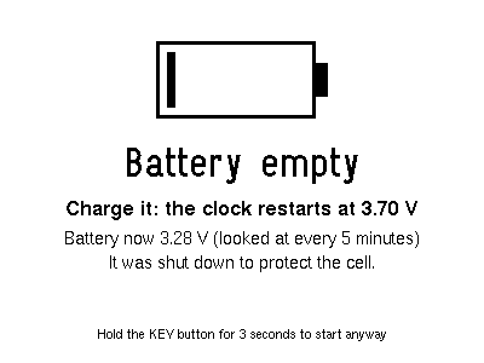

A bare LiPo with no protection board is ruined by being run flat. The board has a protection chip (S-8261) as a last resort,
but it cuts off abruptly and a lot lower, so the **software stops first**:

* when the battery stays under `battery_cutoff_v` (3.30 V, measured while the clock runs) for a minute and the clock is not
  charging, it draws a *Battery empty* screen (which stays on the panel) and goes into deep sleep;
* every five minutes it wakes for a moment to look at the battery, and it **starts again only above 3.70 V**, which means
  after charging: a cell that has just been relieved of the load springs back by a hundred millivolts or more, so
  restarting at the cut-off would boot, sag, shut down and repeat;
* a press of **KEY** wakes it too (not BOOT: that pin also selects the chip's download mode at reset, so it must not be
  held down as the chip wakes): it shows the screen again for eight seconds, and **holding KEY for 3 seconds there starts
  the clock anyway** (for this run only);
* it also checks the battery first thing at every power-up, before the display or WiFi are switched on;
* `low_battery_shutdown = off` or `battery = none` turns all this off.

Deep sleep is not zero: the 3.3 V converter, the display, the RTC and the other chips on the board draw something (not
measured, probably a few hundred microamps), so a cell left alone for weeks in this state can still reach the protection
chip's cut-off.

## Power

The board's owner measured, on USB at 5 V with no battery:

| Setting | Current |
| --- | --- |
| 240 MHz, PSRAM on (Arduino IDE defaults) | 88 to 111 mA |
| **80 MHz, PSRAM disabled** | **about 30 mA idle, peaks around 70 mA** |

That is why the quick start asks for those two Tools settings, and why the sketch sets 80 MHz in code as well
(`cpu_mhz`; the PSRAM can only be switched off in the IDE, so the *Power and settings* page warns when it is on).
The frame timing survives it: after a while at 80 MHz the *Frames* line read **1154 sent, 0 late, worst 2 ms**. Those
figures are with the Arduino core's own WiFi power saving, which the clock still uses (`wifi_power_save = normal`: the
radio sleeps between beacons). `max` lets it sleep a little longer for a little less power, but nothing was measured and
every reply, the network time included, can then come up to a third of a second late, so it is off by default.

On a battery the same power at 3.7 V is more current than at 5 V, so expect roughly 35 to 45 mA (an estimate, not a
measurement): an 18650 of 2500 mAh lasts about two days, a 1000 mAh pouch about a day. **`wifi = off`** removes the
radio's share (and with it the weather, Spotify and network time); it should lower the current further, but by how much
has not been measured.

Things that were considered and **not** done, so nobody wonders:

* **Light sleep between the seconds.** It would take an offline clock from some 20 mA to a few mA, but the chip's slow clock
  during sleep is an internal RC oscillator that is off by a fraction of a percent (minutes a day) and would have to be
  corrected from the RTC every second; that could not be tested here and a wrong clock is worse than a short battery life.
  A route that looks workable: the RTC's interrupt pin is wired to GPIO15, and its 1 Hz countdown timer could wake the chip
  every second from an accurate crystal.
* **Connecting only when something is due** (weather every 15 minutes, NTP hourly) instead of staying associated.
* **Powering down the audio chips** (ES8311 / ES7210 and the amplifier). They are left in their reset state, which is
  low power, and the amplifier's enable pin is held low in deep sleep.

## Troubleshooting

| Symptom | What to try |
| --- | --- |
| White text on a black screen | Hold BOOT for a second (remembered), or set `DISPLAY_INK_IS_BLACK 0` in `config.h`. The default follows Waveshare's LVGL port and the ESPHome ST7305 driver (a set bit is white), so this should not be needed |
| Stuck on *Connecting to WiFi...* | Wrong name or password, or a 5 GHz-only network. With a backup network set the clock alternates between the two every 20 seconds, so check both |
| *Too big (the .merged.bin? use the .ino.bin)* on the firmware screen | The card holds the `….merged.bin` that the IDE exports next to the real firmware; copy `11_Clock_Dashboard.ino.bin` instead |
| *This build was installed from the card before* | The card still holds a file the clock installed (and the firmware has since changed). Build again (every build is different), or type `fwforget` in the serial console |
| The Info page says *the last SD card update was rolled back* | The new firmware reset within its first minute, so the bootloader went back to the old one. Watch the new build's log over USB, fix it and try again |
| The Info page says *(backup)* | The main network could not be joined (or was out of range). The clock looks for it every 10 minutes and goes back by itself, see [A backup network](#a-backup-network) |
| *No WiFi name set (see README)* | `secrets.h` still has the placeholder name and there is no `wifi_ssid` in the settings |
| *No NTP reply (UDP 123 blocked?)* | The router or network blocks NTP; the clock needs it (or a previously set RTC) before it will do HTTPS |
| Weather missing, *Weather update failed* | Check the serial log; the clock retries every minute |
| *Set a location (SD card or secrets.h)* | No `latitude` / `longitude` or `location` anywhere. The clock still tells the time, and the status bar says *Earth* |
| Wrong time zone | Check the coordinates, or set `timezone` |
| *SD card is not FAT32* | The card is exFAT (cards over 32 GB usually are) or not formatted; format it as FAT32 |
| *SD card: cannot write* | The card's write-protect switch is on, or it is damaged; the clock never formats a card |
| *SD settings: ... problems* | The *Power and settings* page lists the first three, with their line numbers |
| The settings file is ignored | It has to be in the card's top folder and called `ESP32-S3-RLCD-Config.txt` (`ESP32-S31-RLCD-Config.txt` is accepted too, in case of a typo); the clock only looks at start-up |
| No battery icon, or the wrong one | It takes about 13 minutes after a reboot and has limits, see [Battery](#battery); type `battery` in the serial console and look at the trend and step |
| Gauge says full on USB with no battery | Say `battery = none` in the settings |
| *Battery empty* screen but the cell is charged | Hold KEY for 3 seconds on that screen to run anyway; check `battery_cutoff_v`; or `low_battery_shutdown = off` |
| Seconds stutter now and then | See [Keeping the seconds on time](#keeping-the-seconds-on-time): the Info page's *Frames* and *Time* lines tell the firmware, the network and the panel apart |
| Digits change a little early or late | Change `DISPLAY_LATENCY_MS` in `config.h` (default 20, the panel adds 0 to 39 ms on top) |
| *App owner needs Premium* | Spotify's rule for development-mode apps; see [Spotify](#spotify) |
| *No active Spotify device* | Start playback once on any device, then use KEY |
| *Rate limited, retry in 4h 46m* | Spotify's quota; wait it out, don't reboot repeatedly |
| Spotify says *redirect_uri: Insecure* | The Redirect URI in the Spotify dashboard is not exactly `http://127.0.0.1:8888/callback` (Spotify accepts plain http only for 127.0.0.1) |
| *Spotify refused the code* when linking | Codes are single use: start again from the first step of the page |

Serial console commands: `status`, `battery`, `config` (every setting, passwords hidden), `timing`, `refresh`, `page N`,
`invert`, `unlink`, `sleeptest` (draws the *Battery empty* screen and goes into the low-battery deep sleep without the
battery being low: the way to try the shutdown on the bench; KEY or five minutes wake it), `reboot`.

## Not yet tried on the board

Written and tested on a PC (and compiled), never run on the real board:

* reading and writing the SD card (the mount follows the repo's `06_SD_Card` example; whether the card slot needs the
  internal pull-ups, and how long the clock takes to notice that no card is there, is unknown);
* the deep-sleep shutdown: the pins held through the sleep, the wake-up by timer and by KEY, the 3 second
  override, and what the sleeping board draws (`sleeptest` in the serial console tries it without a flat battery);
* a `cpu_mhz` change from the SD card file while the display is already running (the display driver has to let go of the
  SPI bus for the moment the clock speed changes; a code review found that without it the boot would hang);
* how close the runtime estimate comes with the real cell;
* the clock drift measurement over real NTP syncs;
* the backup network on the real radio: the switch when the main network cannot be joined, and the scan while connected
  that finds the main network again (the choice of network is tested on a PC, the WiFi calls are not);
* the firmware update from the SD card: reading the file, writing the other app slot, the switch and the restart, the trial
  minute and the rollback (what to do with a file is tested on a PC against the header of a real exported build; the flash
  writing and the bootloader are not);
* the new screens on the real panel (the renders are exact, the panel is not: its contrast and refresh are not modelled);
* from earlier: the Spotify linking flow, the charging indicator, `PIN_CHARGE_STATUS`.

## Files

| File | Role |
| --- | --- |
| `11_Clock_Dashboard.ino` | UI loop (core 1): start-up, frame timing, buttons, sensors, battery, building the frame and the info pages |
| `ui.cpp`, `ui.h` | All drawing (U8g2 C API only, no Arduino code): the screens, the legend, the shutdown screen |
| `settings.h`, `settings.cpp` | The settings: table, the tolerant file parser, the example file writer (pure logic, host-tested) |
| `app_settings.*`, `sdcard.*` | Settings in flash (`cfg` namespace) and on the SD card |
| `net_task.cpp` | Core 0 task: WiFi, NTP, location, weather, time zone, drift measurement |
| `spotify.cpp`, `spotify_parse.cpp` | Spotify: link page (OAuth with PKCE), tokens, polling, commands |
| `link_page.*`, `spotify_helper_script.h` | The Spotify setup page, and the helper script it serves (generated from `tools/spotify_link.py`) |
| `weather.cpp`, `weather_codes.h` | Open-Meteo parsing, weather code to icon/text |
| `sensors.cpp` | SHTC3, PCF85063 RTC and battery (no extra libraries) |
| `power.*` | CPU clock, the low-battery deep sleep |
| `charge.h` | Charging / discharging / full from how the battery voltage moves |
| `battery_est.h`, `low_battery.h` | Runtime left; when to shut down and when to start again |
| `drift.h`, `moon.h`, `datefmt.h` | Clock accuracy measurement, moon phase and its glyph, date formats |
| `wifi_pick.h` | Which WiFi network to try next (main, backup) and when to look for the main one again |
| `fw_logic.h`, `fw_update.h/.cpp` | Firmware update from the SD card: which file is accepted (pure logic) and the card, flash and trial minute |
| `frame_plan.h` | When to draw the coming second and when to send it |
| `ST7305_U8g2.*` | Display driver, derived from `10_U8G2_Test` with an inversion option |
| `app_state.*`, `app_model.h` | Data shared between the two cores |
| `calc.h`, `timeutil.h`, `buttons.h`, `util.h` | Pure helpers, covered by the host tests |
| `tz_table.cpp` | Generated by `tools/gen_tz_table.py` |
| `docs/` | The pictures, and `ESP32-S3-RLCD-Config.example.txt` |

## Developer tools

All optional, and run on a PC (Linux or WSL with `g++`; Python 3 with Pillow for the PNGs). None of it is needed to
build the sketch.

* **`bash tools/ui_preview/run_preview.sh`** compiles `ui.cpp` and the U8g2 C sources for the PC and renders the
  screens (normal, low battery, the battery states, no data yet, long and non-Latin titles, key feedback, Fahrenheit,
  12 hour clock, WiFi off, wide numbers, the legend, the info pages, the shutdown screen ...) to `out/*.pgm`;
  `python to_png.py out/*.pgm` makes PNGs (`--crop`, `--stack` and `--scale` cut out, compare and magnify details). That is
  how the layout was designed without the board, and how the pictures above were made. The run also checks the layout on
  the rendered pixels: numbers that change must not move (thousands of frames, 24 h and 12 h), label text must sit centred
  on its plate, the battery gauge must not shift with the number of digits or run into the status message, today's big
  temperature must start where the condition text does (168 combinations), nothing may touch the weather separators
  (including with -30 °C and 110 °F), every date format must fit, no page may run off the screen, the moon glyph must
  fill and mirror correctly; each check is shown to catch the old, faulty layout before it is trusted.
  `bash tools/ui_preview/run_fuzz.sh` renders thousands of adversarial frames under AddressSanitizer.
* **`bash tools/tests/run_tests.sh`** runs the host tests: calendar and ISO week maths, every time zone rule in the table,
  the SHTC3 CRC, battery curve and humidity maths, the Open-Meteo and Spotify parsers against fixtures (including a
  recorded replies for Perth), PKCE encoding against the RFC 7636 test vector, the setup page, the button gesture detector,
  the charging detector on simulated voltage traces and the frame scheduler on a simulated UI loop (`test_logic`); and
  the 1.3 features (`test_features`): the settings file parser (what people type, bad values, reset, UTF-16, 3000 fuzzed
  files), the example file (it parses back to the same settings, hides passwords, and matches `docs/`), the moon against
  28 published phases, the date formats, the runtime estimate, the shutdown guard and the clock drift measurement on
  simulated data. While they were written, the tests were checked by breaking the code in 50 ways and watching them
  fail. Set
  `ARDUINOJSON_SRC` to ArduinoJson's `src` folder if it is not in `~/Arduino/libraries`.
* **`tools/tests/battery_sim.cpp`** simulates whole battery discharges to choose the constants of `battery_est.h` (see
  the file header: `g++ -std=c++17 -O2 -I../.. battery_sim.cpp`).
* **`bash tools/tests/run_charge_stats.sh`** measures how well `charge.h` does: detection times and false-event rates
  over 300 random voltage traces per scenario, which is where the table in [Battery](#battery) comes from. Give it a
  scenario number and a sequence number to trace one case (`bash run_charge_stats.sh 300 31 7`).
* **`python tools/tests/test_spotify_link.py`** tests the Spotify helper script end to end against a fake clock.
* **`tools/spotify_link.py`** is the helper script; `python tools/gen_helper_header.py` regenerates
  `spotify_helper_script.h` from it (`--check` verifies they match; the tests do too).
* **`tools/gen_tz_table.py`** regenerates `tz_table.cpp` from the tz database.

## Credits and licences

* Weather data by [Open-Meteo.com](https://open-meteo.com/) (CC BY 4.0, free for non-commercial use).
* Display driver derived from Waveshare's `10_U8G2_Test`; graphics by [U8g2](https://github.com/olikraus/u8g2) (BSD-2-Clause).
* [ArduinoJson](https://arduinojson.org/) (MIT). Time zone rules from the IANA tz database (public domain).
* The moon uses the main terms of the series in Jean Meeus, *Astronomical Algorithms*, ch. 47, and the Astronomical
  Almanac's low-precision Sun.
* Spotify is a trademark of Spotify AB; this project is not affiliated with or endorsed by Spotify.
* Spotify rules referenced above:
  [quota modes](https://developer.spotify.com/documentation/web-api/concepts/quota-modes),
  [redirect URIs](https://developer.spotify.com/documentation/web-api/concepts/redirect_uri),
  [refresh token expiry](https://developer.spotify.com/blog/2026-06-18-refresh-token-expiration),
  [PKCE flow](https://developer.spotify.com/documentation/web-api/tutorials/code-pkce-flow).

Licensed under the Apache License 2.0 like the rest of this repository.
